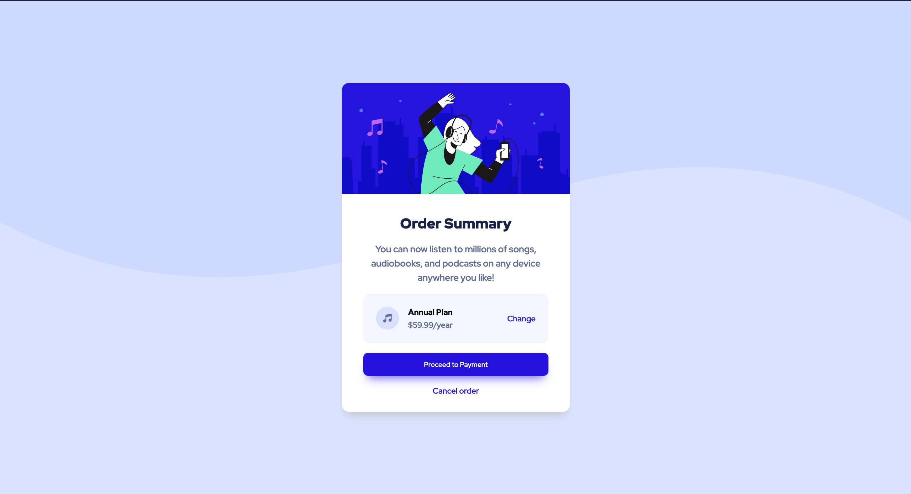

# Frontend Mentor - Order summary card solution

This is a solution to the [Order summary card challenge on Frontend Mentor](https://www.frontendmentor.io/challenges/order-summary-component-QlPmajDUj). Frontend Mentor challenges help you improve your coding skills by building realistic projects. 

## Table of contents

- [Overview](#overview)
  - [The challenge](#the-challenge)
  - [Screenshot](#screenshot)
  - [Links](#links)
- [My process](#my-process)
  - [Built with](#built-with)
  - [What I learned](#what-i-learned)
  - [Continued development](#continued-development)
- [Author](#author)

## Overview

The project include the a description of a plan and it's price, including the purchasing option.

### The challenge

Users should be able to:

- See hover states for interactive elements

### Screenshot

### Links

- Solution URL: [Add solution URL here](https://your-solution-url.com)
- Live Site URL: [Add live site URL here](https://your-live-site-url.com)

## My process

1. Planned out how I want to approach this project and how I want to section it out
2. Started centering all the components
3. Change the characteristics of the text
4. Carefully positioned the plan section using flex
5. Completed the project by adding characteristics to the final part. 

### Built with

- Semantic HTML5 markup
- CSS custom properties
- Flexbox
- CSS Grid

### What I learned

- Learned how to use border-radius on a few of the edges. 
- Learned how to make an svg a background

### Continued development

During this project, I barely dipped my feet in CSS Grid. I would love to experiment with that feature more and see the capabilities it has.

## Author

- LinkedIn - [Aman Zaveri](https://www.linkedin.com/in/aman-zaveri-23a5501b6/)
- Frontend Mentor - [@Aman-Zaveri](https://www.frontendmentor.io/profile/Aman-Zaveri)
